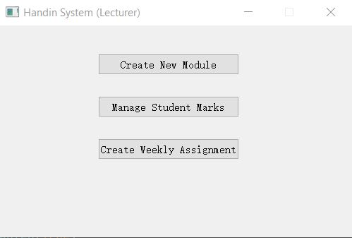
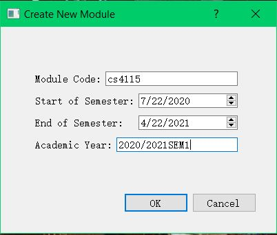
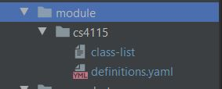
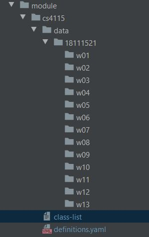
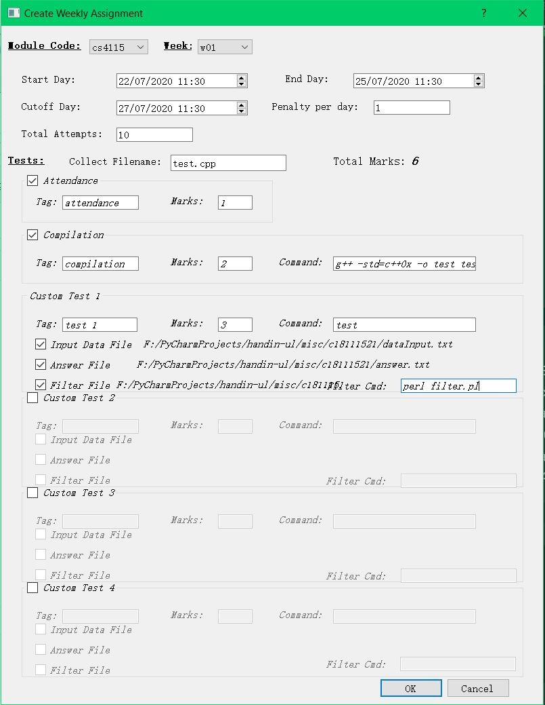
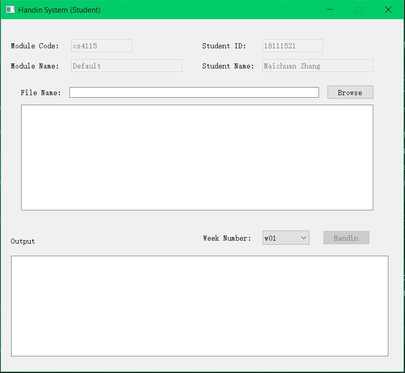
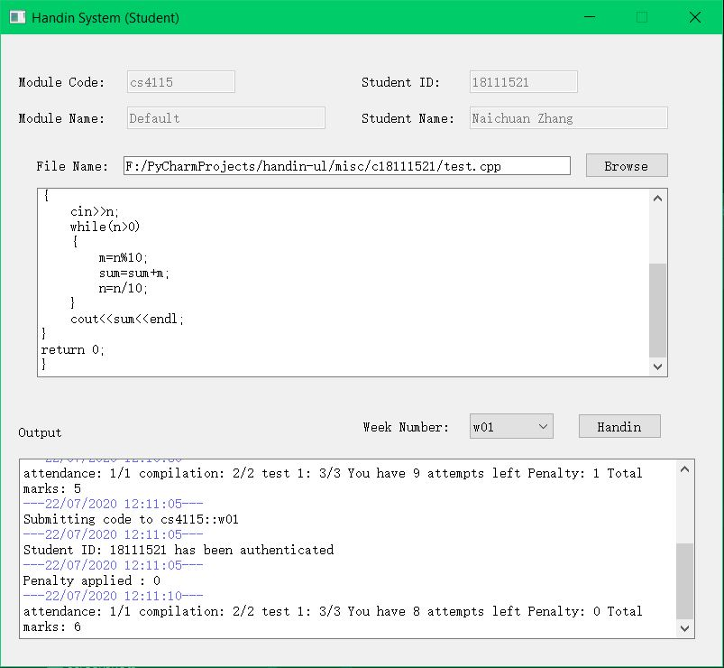
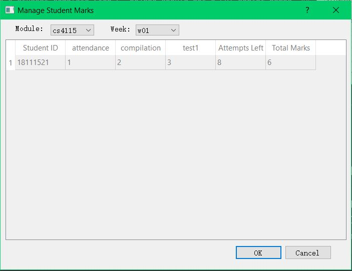
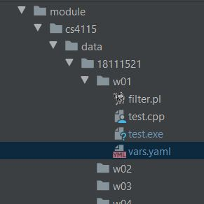

Handin System - UL
===


Program Execution Steps
---
Step 1. Lecturer - run ```handin_lecturer.py``` file, click _Create New Module_ button to create a new module. \


Step 2. Lecturer - fill in the module information, and click OK. \


Step 3. In the current directory, a ```/module/{MODULE_CODE}/``` directory will be automatically created, and the directory named by the module code will contain a ```class-list``` and ```definitions.yaml``` file. \


Step 4. Lecturer - start the server for student to download a ```handin.py``` script (submitting code assignments) by running ```script_download_server.py```. 
The default host and port number can be found in the ```script_download_server.py``` file and are available to be changed: 
```python
HOST = "127.0.0.1"
PORT = 8000
```

Step 5. Student - now the site http://127.0.0.1:8000 is opened for students to provide their student name and ID number, and a link to download the handin.py GUI script will be generated, and students can click the link to get the script file. 

Step 6. In the ```script_download_server.py``` file, the module code and name are pre-defined as shown below:
```python
# TODO: config module code and name here...
MODULE_CODE = "cs4115"
MODULE_NAME = "Default"
```
The default module code is ```cs4115``` and the lecturer needs to ensure that this module code has been created through Steps 1 and 2 (that is, a folder named by this module code exists under ```/module/```).

Step 7. When a student completes Step 5, the student ID will be registered in the ```class-list``` file in the relevant module directory, and a directory named ```/{STUDENT_ID}/``` will be created under the `/data/` directory and a `/temp/` directory will also be created where you can find the handin script file that student downloaded. \


Step 8. Lecturer - the lecturer now can set up a new weekly assignment for student. Simply running ```handin_lecturer.py``` script and clicking _Create Weekly Assignment_. 
In the new popup window, set up an assignment by filling the blanks, and click OK. (The OK button is in a disabled state by default, unless you have completed all the assignment information that needs to be filled in. In addition,
 some lineedit widgets have a matching rule, for example, only numbers can be filled in the lineedit widget of _Total Attempts_). The _Module Code_ dropdown list only displays the registered modules, and _Week_ dropdown list displays w01-w13. \


Step 9. When a lecturer completes Step 8, a `/{WEEK_NUMBER}` directory will be created under the selected module directory `/{MODULE_CODE}/`, and a `params.yaml` configuration file will be automatically created. 
```yaml
# params.yaml
collectionFilename: test.cpp
cutoffDay: 27/07/2020 11:30
endDay: 22/07/2020 11:30
moduleCode: cs4115
penaltyPerDay: 1
startDay: 22/07/2020 11:30
tests:
  attendance:
    marks: 1
    tag: attendance
  compilation:
    command: g++ -std=c++0x -o test test.cpp
    marks: 2
    tag: compilation
  test1:
    answerFile: F:/PyCharmProjects/handin-ul/misc/c18111521/answer.txt
    command: test
    filterCommand: perl filter.pl
    filterFile: F:/PyCharmProjects/handin-ul/misc/c18111521/filter.pl
    inputDataFile: F:/PyCharmProjects/handin-ul/misc/c18111521/dataInput.txt
    marks: 3
    tag: test 1
totalAttempts: 10
weekNumber: w01
```

Step 10. Lecturer - if a lecturer wants to create a weekly assignment, the `handin_lecturer.py` script only allows lecturer to create maximum of 4 custom tests by default. Sometimes, a lecturer might need to add a fifth custom test, in this case, you can directly set up another test by editing `params.yaml` config file. 

Step 11. Lecturer - after a weekly assignment has been setup for a specific module, lecturer should start handin system server by running `system_server.py`. The default host and port number of system server are initiated in `const.py` by default.
```python
# Handin System Server Configs
HANDIN_HOST = '127.0.0.1'
HANDIN_PORT = 5000
```

Step 12. Student - when a student complete Step 5, he/she should get a GUI script named `handin.py`, run this script.


Step 13. Student - student can submit assignments using this GUI script. Browse a program file to submit and select a weekly number, when the _Handin_ button is clicked. The script will try to connect to the handin system server and submit the program. The server responses.



Step 14. Lecturer - a lecturer can check students' marks, attempts left by running `handin_lecturer.py` and clicking _Manage Student Marks_ button.
 

Step 15. Lecturer - in addition, a lecturer can also check student programs by visiting `/data/` directory. In each week folder, there's a `vars.yaml` file to store student's assignment info of a specific week.



Required Python Modules
---
1. Python 3.x (Student, Lecturer)
2. PyQt5 (Student, Lecturer)
3. yaml (Lecturer)
